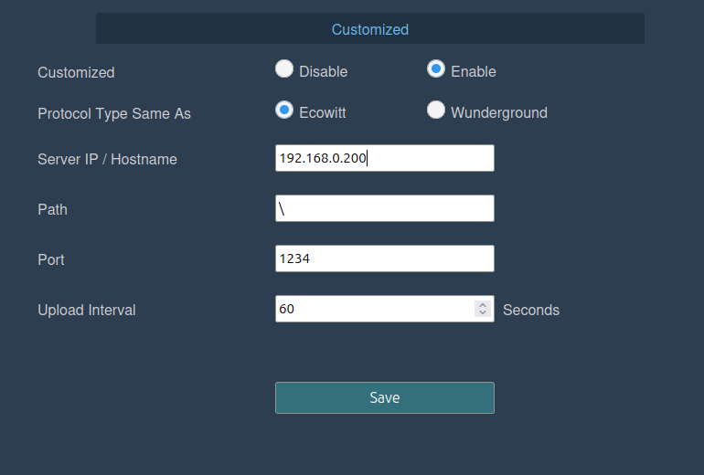

# Ecowitt2APRS

**Ecowitt2APRS** is a lightweight Linux service that connects weather data from Ecowitt compatible weather stations to the APRS-IS network, transmitting the data in the form of APRS weather packets. It is written in C and is designed to run on minimal Linux systems, such as low-power SBCs.

## Features

- Receives Ecowitt weather data via HTTP POST.
- Converts and forwards data to APRS-IS as standard APRS weather packets.
- Runs as a background systemd service.
- Lightweight and efficient — suitable for embedded systems and SBCs like Raspberry Pi.

## Requirements

- GCC (or compatible C compiler)
- Linux system with `systemd`
- Internet connection (to forward packets to APRS-IS)
- Compatible Ecowitt weather station or gateway (e.g., GW2000C, WH2650)

> Weather data should be responsibly reported. Make sure your station is properly calibrated and positioned before forwarding to APRS-IS.

## Build

Clone the repository and build the binary:

```bash
make
```

This will produce:

* A binary: `bin/ec-aprs-wx`
* A sample configuration file: `bin/config.cfg`

## Install

To install the binary, configuration file, and systemd service:

```bash
sudo make install
```

This will:

* Copy the binary to `/usr/local/bin/ec-aprs-wx`
* Copy the configuration file to `/etc/ec-aprs-wx.cfg`
* Install and enable a `systemd` service at `/etc/systemd/system/ec-aprs-wx.service`

## Configuration

Edit `/etc/ec-aprs-wx.cfg` to set:

* `APRS_CALLSIGN_SSID`: APRS callsign (e.g., `4S6DRJ`).
* `APRS_PASSCODE`: APRS-IS passcode. To generate the passcode, [use this service](https://apps.magicbug.co.uk/passcode/).
* `APRS_LATITUDE`: Latitude in APRS format (e.g., `4903.50N`).
* `APRS_LONGITUDE`: Longitude in APRS format (e.g., `07201.75W`).

### Starting the service

```bash
sudo systemctl start ec-aprs-wx
```

### Enable service on boot

```bash
sudo systemctl enable ec-aprs-wx
```

## Configuration for the Ecowitt Hub

To send data to *Ecowitt2APRS*, follow these configuration steps on the Ecowitt hub:

* Enable the customized weather service.
* Set the protocol type to `Ecowitt`.
* For the Server IP, specify the IP address of the PC or SBC hosting the *Ecowitt2APRS* service.
* Set the Path to: `\`.
* Use Port: `1234`.
* Set the upload interval to `60` seconds, or another preferred value supported by your Ecowitt hub.

Make sure to save your changes after updating the settings.



## Clean

To remove all build artifacts:

```bash
make clean
```

## License

This project is licensed under the GNU GPL Version 3. See [LICENSE](LICENSE) for details.